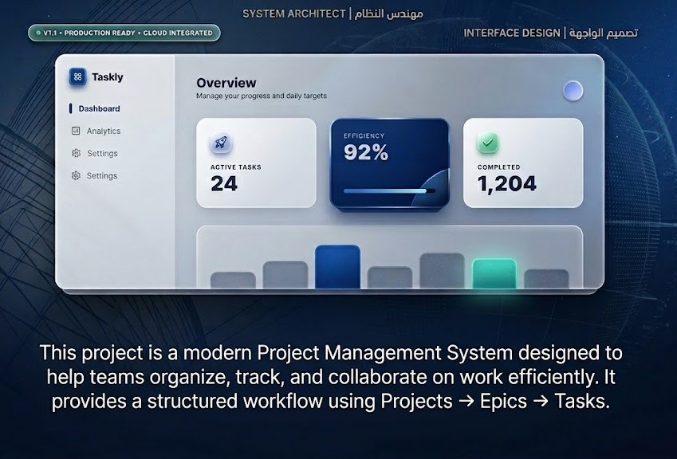

# Taskly



Taskly is a task and project management app built with Next.js App Router, TypeScript, Supabase, and React Query.

## What Is New

- Feature-first architecture under `src/features` (auth, project, invite, my-statistics, workspace-shell)
- Shared UI primitives and domain-agnostic components moved into `src/components` and `src/shared`
- Route pages in `src/app` now focus on composition while feature modules hold most logic
- Updated auth recovery setup with `NEXT_PUBLIC_PASSWORD_RESET_REDIRECT_URL`

## Core Features

- Authentication: login, signup, forgot password, reset password
- Projects: create, edit, list, and manage project members
- Tasks: board/list workflows and status tracking
- Epics: organize tasks by higher-level goals
- Invitations: join projects via invitation flow
- Statistics: project and personal productivity views

## Tech Stack

- Next.js 15 (App Router)
- React 19 + TypeScript
- Tailwind CSS 4
- Supabase (`@supabase/supabase-js`, `@supabase/ssr`)
- NextAuth
- TanStack React Query
- dnd-kit
- shadcn/ui + Sonner + Lucide
- Zod + React Hook Form

## Project Structure

```txt
src/
  app/                    # Route segments and page entry points
  features/               # Feature modules (business logic + feature UI)
  components/             # Reusable UI primitives, providers, common/loading UI
  shared/
    components/           # Shared cross-feature building blocks
  lib/
    actions/              # Data actions
    types/                # Shared and feature typings
    schemes/              # Validation schemas
```

## Prerequisites

- Node.js 18+ (latest LTS recommended)
- Yarn 1.x

## Environment Variables

Copy `.env.example` to `.env.local` and fill in values:

```env
SUPABASE_URL=your_supabase_url
SUPABASE_ANON_KEY=your_supabase_anon_key
NEXTAUTH_URL=http://localhost:3000
NEXTAUTH_SECRET=your_nextauth_secret
NEXT_PUBLIC_PASSWORD_RESET_REDIRECT_URL=http://localhost:3000/reset-password
```

## Getting Started

Install dependencies:

```bash
yarn install
```

Run development server:

```bash
yarn dev
```

Open [http://localhost:3000](http://localhost:3000).

## Available Scripts

- `yarn dev` - start local development server
- `yarn build` - build for production
- `yarn start` - run production server
- `yarn lint` - run ESLint

## Quality Checks

Before pushing changes:

```bash
yarn lint
yarn build
```
